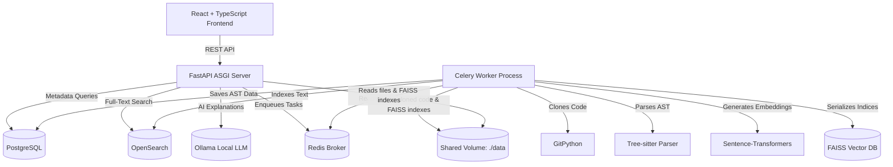

# GitHub Code Intelligence Platform

A high-performance, local-first code analysis, indexing, and intelligence platform. It allows developers to import any public GitHub repository, parse its source code structure using Tree-sitter, index elements in PostgreSQL and OpenSearch, generate semantic vector embeddings via sentence-transformers, perform keyword and semantic similarity searches, analyze class/method dependency and call graphs, detect duplicate functions, and explain functions using local LLMs through Ollama.

---

## High-Level Architecture



---

## Feature Highlights

- **VS Code Inspired UI/UX**: Dark-themed developer-centric interface featuring a collapsible activity bar, file explorer tree, tabbed editor interface, integrated graphs board, dashboard metrics, and AI assistant chat sidebar.
- **Tree-sitter AST Parser**: Fully local syntax tree extraction supporting Python, JavaScript, TypeScript, Go, C++, and Java. Extracts classes, methods, imports, comments, signatures, and line spans.
- **Hybrid Code Search**:
  - **Keyword Search**: Powered by OpenSearch (with a database-driven `ILIKE` fallback if OpenSearch is starting or offline).
  - **Semantic AI Search**: Uses a local `all-MiniLM-L6-v2` transformer model and a FAISS index to understand code concepts naturally (e.g. searching "authentication" returns JWT and OAuth middleware even if the word is absent).
- **Interactive Relations Graphs**: Renders file-level import dependencies and method-level static call relationships using **React Flow** with interactive panning, zooming, and click-to-file navigation.
- **Local AI Analysis**: Connects directly to local Ollama instances (e.g., `qwen2.5-coder` or `deepseek-coder`) to stream method summaries, time/space complexities, improvements, bug reports, and refactoring tips.
- **Duplicate Code Detector**: Computes pairwise cosine similarities across all function embeddings in the FAISS index to find copy-pasted or highly similar code chunks with side-by-side comparison splits.
- **Precomputed Repository Metrics**: Calculates lines of code, average method length, language distribution charts, and details the top 10 largest files.

---

## Technology Stack

### Backend
- **Core Framework**: FastAPI (Asynchronous REST API)
- **Database Engine**: SQLAlchemy ORM & Alembic migrations
- **Background Worker**: Celery & Redis
- **Syntax Parsing**: Tree-sitter & `tree-sitter-languages`
- **Text Search**: OpenSearch & `opensearch-py`
- **Vector Search**: FAISS (Facebook AI Similarity Search) & `sentence-transformers`
- **Local AI Model Runner**: Ollama API

### Frontend
- **Framework**: React 19 (Vite + TypeScript)
- **Styling**: Tailwind CSS v3 (VS Code dark theme palette)
- **Graphing**: React Flow
- **Code Editor**: Monaco Editor

---

## Folder Structure

```
github-code-intelligence/
├── docker-compose.yml       # Orchestrates all services (db, redis, search, backend, worker, frontend)
├── .env.example             # Configuration settings template
├── README.md                # System documentation
├── docker/                  # Docker build files
│   ├── backend.Dockerfile
│   ├── worker.Dockerfile
│   └── frontend.Dockerfile
├── backend/                 # FastAPI REST API Server
│   ├── app/
│   │   ├── main.py          # FastAPI application entry point
│   │   ├── config.py        # System configuration loader
│   │   ├── database.py      # SQLAlchemy setup
│   │   ├── models.py        # Relational schemas
│   │   ├── schemas.py       # Pydantic serializer models
│   │   ├── api/             # API Router and Endpoints
│   │   └── services/        # Business logic services (Repository, Graph)
│   ├── alembic/             # Alembic migration files
│   └── requirements.txt     # Python requirements
├── parser/                  # Tree-sitter AST extraction library
│   ├── __init__.py
│   └── tree_sitter_parser.py
├── worker/                  # Celery worker process
│   ├── app/
│   │   ├── celery_app.py    # Celery configuration
│   │   └── tasks.py         # Repository cloning and indexing tasks
│   └── requirements.txt     # Celery dependencies
├── frontend/                # React Vite Frontend application
│   ├── src/                 # Application codebase (App.tsx, components, services)
│   ├── index.html
│   ├── package.json
│   └── tailwind.config.js
├── tests/                   # Pytest automation suite
└── docs/                    # Architecture and developer docs
```

---

## Setup & Running Guide

### Prerequisites
- Docker & Docker Compose
- Ollama running locally (with your preferred model pulled: e.g. `ollama pull qwen2.5-coder:1.5b`)

### Running with Docker Compose (Recommended)

1. **Clone and Enter Repository**:
   ```bash
   git clone https://github.com/vmanam1/github-code-intelligence.git
   cd github-code-intelligence
   ```

2. **Configure Environment Variables**:
   Copy `.env.example` to `.env`. The defaults are configured to work seamlessly out-of-the-box inside Docker:
   ```bash
   cp .env.example .env
   ```

3. **Launch the Container Cluster**:
   Run compose to build and start the database, caching, indexing, worker, API server, and Vite dev server:
   ```bash
   docker-compose up --build
   ```

4. **Verify Application Ports**:
   - **Frontend UI**: `http://localhost:5173`
   - **Backend REST API**: `http://localhost:8000/api`
   - **Swagger API Docs**: `http://localhost:8000/docs`

---

## API Documentation Summary

Exposed via FastAPI Swagger UI at `http://localhost:8000/docs`:

### Repositories
- `POST /api/repositories/` - Import a repository URL (starts cloning/indexing Celery task).
- `GET /api/repositories/` - List all repositories.
- `GET /api/repositories/{id}` - Fetch repository metadata and indexing status.
- `GET /api/repositories/{id}/file` - Safely read a file's content from disk (prevents path traversal).
- `POST /api/repositories/{id}/index` - Manually trigger repository re-indexing.
- `DELETE /api/repositories/{id}` - Wipe repository disk files, Postgres records, search index, and FAISS index.

### Search
- `GET /api/search/text` - Full-text keyword search across file names, classes, methods, and docstrings.
- `GET /api/search/semantic` - Vector similarity search using natural language queries.

### Relations Graphs
- `GET /api/graphs/dependency` - Map import statements into a file-level directed dependency graph.
- `GET /api/graphs/call` - Static-analysis call graph mapping relationships between functions.

### Functions & AI Analysis
- `GET /api/functions/{id}` - Fetch function details, lines, and body code.
- `POST /api/functions/{id}/explain` - Send function body to local Ollama LLM to generate complexity, improvement, and bug summaries.
- `GET /api/functions/duplicates/detect` - Calculate pairwise similarities to find matching/copied functions.

### Statistics
- `GET /api/statistics/` - Fetch precomputed files, LOC, function lengths, and language metrics.

---

## License

This project is open-source software licensed under the [MIT License](LICENSE).
