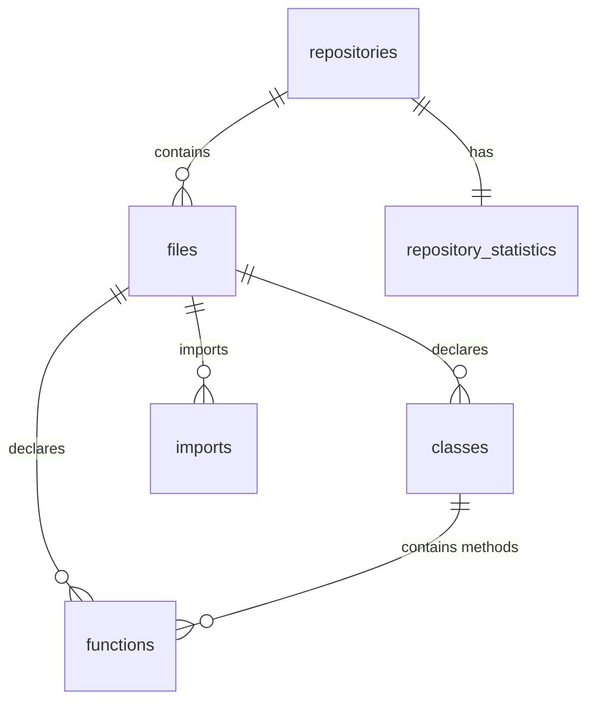

# Database Schema Specification

The **GitHub Code Intelligence Platform** uses a normalized relational model inside PostgreSQL. This document details each table's structure, constraints, relationships, and indices.

---

## Entity Relationship Overview

---

## 1. Table: `repositories`

Stores metadata about cloned git workspaces and their indexing status.

| Column | Type | Constraints | Default | Description |
| :--- | :--- | :--- | :--- | :--- |
| `id` | VARCHAR(36) | PRIMARY KEY | uuid4() | Unique UUID identifying the repository |
| `name` | VARCHAR(255) | NOT NULL | | Display name of the repository |
| `url` | VARCHAR(1024) | NOT NULL | | Public GitHub repository URL |
| `clone_path` | VARCHAR(1024) | Nullable | | Absolute local directory path of cloned files |
| `status` | VARCHAR(50) | NOT NULL | `PENDING` | Lifecycle status: `PENDING`, `CLONING`, `PARSING`, `INDEXING`, `COMPLETED`, `FAILED` |
| `error_message` | TEXT | Nullable | | Stack trace or exception message if index fails |
| `created_at` | TIMESTAMP WITH TZ | | `now()` | Record creation timestamp |
| `updated_at` | TIMESTAMP WITH TZ | | `now()` | Record update timestamp |

---

## 2. Table: `files`

Contains metadata about parsed files within the repository.

| Column | Type | Constraints | Default | Description |
| :--- | :--- | :--- | :--- | :--- |
| `id` | VARCHAR(36) | PRIMARY KEY | uuid4() | Unique UUID identifying the file |
| `repository_id` | VARCHAR(36) | FOREIGN KEY -> `repositories.id` (ON DELETE CASCADE) | | Parent repository link |
| `path` | VARCHAR(1024) | NOT NULL | | Relative file path from repository root |
| `language` | VARCHAR(50) | NOT NULL | | Detected programming language |
| `size` | INTEGER | NOT NULL | | File size in bytes |
| `lines_count` | INTEGER | NOT NULL | | Total lines of code in the file |
| `created_at` | TIMESTAMP WITH TZ | | `now()` | Creation timestamp |
| `updated_at` | TIMESTAMP WITH TZ | | `now()` | Update timestamp |

---

## 3. Table: `classes`

Parsed class declarations in supported code files.

| Column | Type | Constraints | Default | Description |
| :--- | :--- | :--- | :--- | :--- |
| `id` | VARCHAR(36) | PRIMARY KEY | uuid4() | Unique class identifier |
| `file_id` | VARCHAR(36) | FOREIGN KEY -> `files.id` (ON DELETE CASCADE) | | Parent file link |
| `name` | VARCHAR(255) | NOT NULL | | Name of the class |
| `start_line` | INTEGER | NOT NULL | | Start line index (1-indexed) |
| `end_line` | INTEGER | NOT NULL | | End line index (1-indexed) |
| `body` | TEXT | NOT NULL | | Full text block containing the class definition |
| `docstring` | TEXT | Nullable | | Parsed class docstring/comments |

---

## 4. Table: `functions`

Parsed global functions and class methods.

| Column | Type | Constraints | Default | Description |
| :--- | :--- | :--- | :--- | :--- |
| `id` | VARCHAR(36) | PRIMARY KEY | uuid4() | Unique function identifier |
| `file_id` | VARCHAR(36) | FOREIGN KEY -> `files.id` (ON DELETE CASCADE) | | Parent file link |
| `class_id` | VARCHAR(36) | FOREIGN KEY -> `classes.id` (ON DELETE CASCADE), Nullable | | Parent class link (if a method) |
| `name` | VARCHAR(255) | NOT NULL | | Name of the function |
| `signature` | TEXT | NOT NULL | | Method signature/header definition |
| `start_line` | INTEGER | NOT NULL | | Start line index (1-indexed) |
| `end_line` | INTEGER | NOT NULL | | End line index (1-indexed) |
| `body` | TEXT | NOT NULL | | Full source code of the function |
| `docstring` | TEXT | Nullable | | Parsed docstring or associated leading comments |

---

## 5. Table: `imports`

Extracted file-level import statements. Used to construct import dependency graphs.

| Column | Type | Constraints | Default | Description |
| :--- | :--- | :--- | :--- | :--- |
| `id` | VARCHAR(36) | PRIMARY KEY | uuid4() | Unique import identifier |
| `file_id` | VARCHAR(36) | FOREIGN KEY -> `files.id` (ON DELETE CASCADE) | | File containing the import |
| `source` | VARCHAR(255) | NOT NULL | | Import source (e.g. `datetime`, `./utils`) |
| `name` | VARCHAR(255) | NOT NULL | | Imported symbol or submodule (e.g. `datetime`, `*`) |
| `alias` | VARCHAR(255) | Nullable | | Import alias (e.g. `dt` from `import x as dt`) |
| `line_number` | INTEGER | NOT NULL | | Line where the import is declared |

---

## 6. Table: `repository_statistics`

Precomputed stats dashboard metrics for repositories.

| Column | Type | Constraints | Default | Description |
| :--- | :--- | :--- | :--- | :--- |
| `id` | VARCHAR(36) | PRIMARY KEY | uuid4() | Unique stats identifier |
| `repository_id` | VARCHAR(36) | FOREIGN KEY -> `repositories.id` (ON DELETE CASCADE), UNIQUE | | Associated repository link |
| `total_files` | INTEGER | NOT NULL | 0 | Total indexable code files |
| `total_lines_of_code` | INTEGER | NOT NULL | 0 | Sum of LOC across files |
| `total_functions` | INTEGER | NOT NULL | 0 | Total parsed functions/methods |
| `total_classes` | INTEGER | NOT NULL | 0 | Total parsed classes |
| `language_distribution` | JSON | NOT NULL | `{}` | Count mapping of files per language |
| `avg_function_size` | FLOAT | NOT NULL | 0.0 | Average function lines length |
| `largest_files` | JSON | NOT NULL | `[]` | List of top 10 largest files with size/lines |
| `updated_at` | TIMESTAMP WITH TZ | | `now()` | Last precomputation update timestamp |

---

## Recommended Database Indices

To ensure snappy search operations and rapid joins during graph generation:
- `idx_files_repository_id`: Speeds up file scans per repository.
- `idx_classes_file_id`: Accelerates class loading.
- `idx_functions_file_id`: Accelerates function loading.
- `idx_imports_file_id`: Optimizes dependency graph queries.
